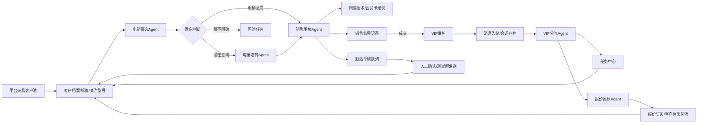
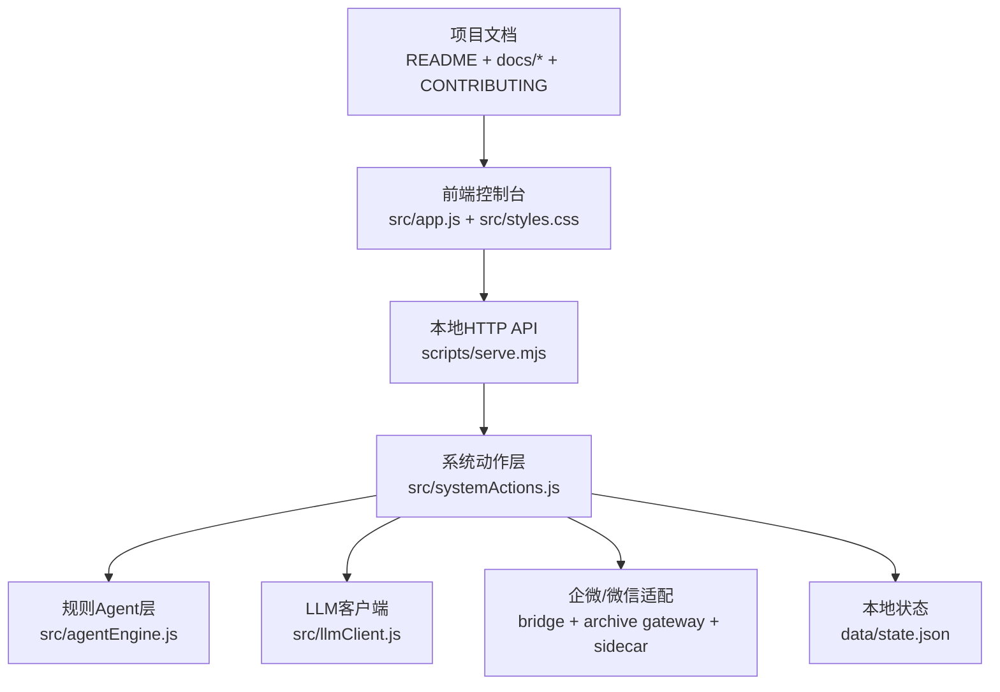

# 智能客服与客户运营中台

面向有历史交易数据的平台客户运营场景，本项目用于验证一套从“意向客户筛选、销售承接、VIP群维护、报价推送、任务闭环、数据回流”到“模型与企微/个人微信接入”的一体化客户运营系统。

当前版本是 **本地可运行验证版 + 真实企微接入准备版**：系统会真实写入本地客户档案、任务、报价、会话、触达草稿、模型配置、企微配置、统一出站Sidecar状态、Agent运行记录和审计日志；不会真实外呼、发短信、发企微私聊或同步CRM。企微智能机器人可作为测试真实读取入口；生产主读取链路以企微会话内容存档Sidecar为准。确认回复只有在出站Sidecar声明 `canSend=true` 后才会真实发送，且回读确认前不能算闭环完成。

## 目录

- [业务背景](#业务背景)
- [系统目标](#系统目标)
- [当前能力](#当前能力)
- [业务闭环](#业务闭环)
- [系统结构](#系统结构)
- [运行方式](#运行方式)
- [模型与外部连接](#模型与外部连接)
- [当前进度](#当前进度)
- [测试与质量](#测试与质量)
- [文档与协作规则](#文档与协作规则)
- [生产化边界](#生产化边界)

## 业务背景

平台已经沉淀了一批有交易体量、采购频次和具体机型偏好的客户。当前业务希望把这些客户从“可运营数据”转成“可持续推进的客户关系”，核心链路包括：

1. 电销团队筛选意向客户，判断是否需要进入销售承接或继续培育。
2. 销售团队在线承接客户，销售会员卡，并沉淀可复用销售话术。
3. 私域/VIP团队维护已购卡客户，在群里分流售前、售后、报价、投诉等问题。
4. 报价和客户偏好持续回流，形成更精准的型号推荐、触达草稿和下一步任务。

这个项目不是单点客服机器人，而是一个把客户档案、Agent、任务、报价、消息、模型配置和外部连接统一起来的客户运营中台。

## 系统目标

- 建立统一客户档案：用交易额、采购频次、关注型号、会员状态、标签和事件流维护客户画像。
- 跑通业务链路：支持电销筛选、销售承接、VIP维护、报价推荐、触达草稿和闭环编排。
- 让Agent可控：默认使用本地规则Agent稳定执行，按需调用真实LLM增强，不自动外发。
- 让外部接入可替换：测试期用企微智能机器人验证真实消息进入系统，生产期走企微会话存档读取和统一Sidecar出站。
- 让流程可审计：所有关键动作写入任务、事件、日志和审计，避免“看起来执行了但没有记录”的假闭环。

## 当前能力

| 模块 | 已实现能力 | 当前边界 |
| --- | --- | --- |
| 客户管理 | 18个本地样例客户，全量客户档案列表优先展示，支持搜索、筛选、双击进入详情维护、新增二级页 | 未接真实交易主数据和CRM |
| 电销管理 | 电销客户池、外呼筛选Agent、电销培育Agent、电销会话工作台、意向评分、客户分层、回访/销售任务生成 | 未接真实外呼、ASR和短信 |
| 销售管理 | 销售客户、销售承接Agent、销售会话工作台、会员卡意向判断、话术草稿、报价异议处理、销售样本库和LLM增强 | 未接生产级知识库、成交模型和自动质检 |
| VIP群管理 | VIP客户、VIP会话工作台、报价订阅、企微会话存档/智能机器人/Sidecar会话聚合、VIP分流Agent、@对象识别、售前/售后/报价/投诉任务分流 | 图片和文件第一版占位入站并生成任务；撤回、引用回复和真实已读仍待扩展 |
| 报价订阅 | 归属VIP群管理，支持结构化报价、型号搜索、品牌/配置/库存/价格范围筛选、关注型号订阅和推荐理由 | 未接报价图片OCR和报价版本管理 |
| 任务中心 | 统一任务、负责人角色、SLA、批量状态更新、超时主管升级和完成时间回写 | 未接排班、提醒和关闭质检 |
| 触达草稿 | Agent和人工生成待确认文案，支持确认、复制、废弃、批量处理、高风险阻断 | 默认不触达客户；只有测试群Webhook会真实发送 |
| 模型配置 | 全局LLM、Agent独立LLM覆盖、ASR/TTS配置保存、OpenAI兼容连接测试、按需LLM增强 | ASR/TTS尚未真实调用；生产需密钥管理 |
| 企微接入 | 真实连接中心、会话内容存档Sidecar配置和ACK、智能机器人真实测试入口、统一出站Sidecar能力声明、群绑定、日志筛选、消息去重和脱敏配置 | 官方会话存档SDK或第三方协议服务需在Sidecar内完成拉取/解密/登录态 |
| 统一出站Sidecar / AccountAgent | 单账号多群上下文、低风险队列、高风险人工确认、人工放行、连续消息合并、SendScheduler、`canSend`能力校验、Sidecar出站回调、失败退避、回读确认 | 默认Mock只能本地演练；真实登录、协议发送和自回显监听由外部Sidecar承担 |
| 稳定性与审计 | 输入校验、状态自检、敏感信息脱敏、静态访问拦截、审计日志、61个自动化测试 | 本地JSON不是生产数据库 |

## 业务闭环



## 系统结构



核心数据对象：

- `CustomerProfile`：客户档案、交易数据、阶段、标签、关注型号。
- `Conversation`：本地/企微/个人微信群消息上下文。
- `HandoffTask`：统一任务中心对象。
- `OutboundDraft`：待确认触达草稿。
- `ModelConfig`：全局和Agent模型配置。
- `WeComConfig` / `WeComBinding` / `WeComLog`：企微配置、群绑定和日志。
- `PersonalWechat` / `PersonalWechatSendJob`：个人微信AccountAgent上下文和发送队列。
- `ChatSession`：从会话存档、智能机器人、个人微信/统一Sidecar和本地调试会话投影出的统一聊天工作台会话。
- `AgentRun` / `AuditLog`：Agent输出和审计记录。

## 运行方式

安装依赖：

```bash
npm install
```

启动本地系统：

```bash
npm run dev
```

默认访问地址：

```text
http://127.0.0.1:5175
```

运行测试：

```bash
npm test
```

启动企微智能机器人长连接读取：

```bash
npm run wecom:bridge
```

启动企微会话内容存档 Gateway：

```bash
npm run wecom:archive
```

只检查会话存档 Gateway 配置：

```bash
npm run wecom:archive -- --check
```

Gateway 默认调用你配置的 Sidecar `/pull` 接口，由 Sidecar 负责企微会话存档 SDK、协议服务、登录态、解密、CDN文件和原始消息适配；本系统只接收标准化后的消息并按渠道写入电销、销售或VIP对应的会话工作台。

只验证企微 Bot ID/Secret 是否能认证：

```bash
npm run wecom:bridge -- --check --timeout=20000
```

启动统一出站 Sidecar 调度器：

```bash
npm run personal-wechat:gateway
```

只检查统一出站 Sidecar 配置：

```bash
npm run personal-wechat:gateway -- --check
```

本地运行状态保存在：

```text
data/state.json
```

`data/state.json` 已加入 `.gitignore`。前端状态接口不会返回明文API Key、企微Webhook、Bot ID 或 Secret，只返回是否已配置和掩码。

## 模型与外部连接

### LLM / ASR / TTS

- 全局LLM配置适用于所有Agent。
- 每个Agent可以单独覆盖模型；未配置时继承全局。
- 模型测试走OpenAI兼容 `chat/completions`。
- Agent默认不调用LLM；只有在模型配置页测试连接，或在Agent控制台勾选真实LLM增强时才会调用。
- ASR/TTS当前只保存连接参数，尚未接真实语音外呼执行器。

### 企微

当前企微链路分三层：

1. 会话内容存档 Gateway：生产主读取入口，对应 `npm run wecom:archive`、`/api/wecom/archive/status` 和 `/api/wecom/archive/inbound`。Sidecar最小接口为 `GET /health`、`POST /pull`、`POST /ack`。
2. 智能机器人长连接：用于真实读取企微智能机器人消息，按 `chatid` 独立归档，作为辅助/测试读取入口。
3. 测试群机器人Webhook：只用于发送测试消息和已确认草稿，不能读取群消息。

企微/微信协议服务可作为 Sidecar 对接，建议只暴露标准动作：实例健康、登录态、消息回调、发送文本/群@、标记已读、联系人/群同步、文件CDN下载。系统内部不直接耦合某个协议供应商，所有入站先转成统一 `roomId/messageId/senderType/text/source` 结构。非文本消息第一版会以占位文本入站，并生成客服人工查看任务。

### 业务会话工作台

- 默认只展示真实来源：企微会话存档、企微智能机器人和个人微信/Sidecar；本地模拟只在“本地调试”筛选中查看。
- 电销管理下的“电销会话”只看电销企微培育和托管号真实会话。
- 销售管理下的“销售会话”只看会员卡销售承接相关的企微和托管号真实会话。
- VIP群管理下的“VIP会话”只看已购会员和VIP小群相关会话。
- 每个入口仍复用同一套会话投影、搜索筛选、聊天窗口、客户绑定、Agent判断、任务、报价和发送队列，避免三套数据割裂。
- 外部群回复不会直接标记为已发送；低风险进入SendScheduler，高风险进入人工确认，真实回读确认后才算闭环。

### 个人微信AccountAgent

当前出站链路支持 Mock 演练和统一 Sidecar 真实出站：

- 一个个人微信账号对应一个 `AccountAgent`。
- 一个账号维护多个外部群上下文。
- 低风险客户消息进入 `queued`。
- 高风险报价、锁价、退款、赔偿、付款、合同、责任承诺进入人工确认。
- 高风险任务必须人工放行后才会回到 `queued`。
- SendScheduler负责同群FIFO、账号并发、分钟上限、过期重判和失败退避。
- Mock模式下调度后进入 `sent_pending_confirm`，只用于本地流程验证，不代表真实发送。
- Sidecar模式必须先通过 `/health` 声明 `canSend=true`，调度后才会进入 `sending`，由 `npm run personal-wechat:gateway` 调用外部发送服务；Gateway回调后进入 `sent_pending_confirm`。
- 只有自回显或会话存档回读确认后才会进入 `confirmed`，并写入本地会话和事件。

## 当前进度

| 阶段 | 状态 | 说明 |
| --- | --- | --- |
| 本地客户运营闭环 | 已可运行 | 客户、任务、报价、草稿、会话、Agent和审计能在本地闭环 |
| UI业务工作台 | 已可运行 | 左侧按总览、客户管理、电销管理、销售管理、VIP群管理、设置分组 |
| LLM配置与增强 | 已可运行 | 支持真实模型连接测试和按需Agent增强 |
| 企微测试群Webhook | 已可运行 | 可把已确认草稿发送到测试群机器人 |
| 企微智能机器人长连接 | 已可运行 | 可读取真实智能机器人消息并按 `chatid` 归档 |
| 业务会话工作台 | 已可运行 | 电销、销售、VIP各有入口和默认会话范围，默认只展示真实来源，支持绑定客户、回复入队、待回读和发送失败状态 |
| 企微会话内容存档 | Sidecar主链路骨架完成 | 已固定 `/health`、`/pull`、`/ack` 契约；真实SDK/协议拉取、解密和客户同意校验由Sidecar适配 |
| 统一出站Sidecar / AccountAgent | Mock闭环 + Sidecar能力校验完成 | `canSend=true` 后才允许真实出站；真实登录、协议收发、自回显监听和生产风控待接 |
| 多人协作规范 | 已建立 | PR模板、CI、CONTRIBUTING和分支规则已建立 |
| 生产化 | 待建设 | 数据库、权限、密钥管理、审批、监控、外部系统同步待补 |

## 测试与质量

当前自动化测试覆盖 61 个用例，包括：

- Agent基础业务链路。
- 任务、报价、客户、模板输入校验。
- 模型配置、LLM连接测试和LLM增强边界。
- 企微Webhook、智能机器人入站、会话存档入站和消息去重。
- 电销/销售/VIP会话工作台投影、客户绑定、回复入队和高风险人工确认。
- 统一出站Sidecar能力声明、AccountAgent、Gateway健康检查、人工放行、SendScheduler、Sidecar出站回调、失败退避和回读确认。
- 状态自检、能力审计、脏数据恢复和安全边界。

常用检查：

```bash
npm test
node --check src/app.js
node --check src/systemActions.js
node --check scripts/serve.mjs
node --check scripts/wecom-archive-gateway.mjs
node --check scripts/personal-wechat-send-gateway.mjs
```

GitHub Actions 会在 Pull Request 和 `main` 推送时运行 `npm test`。

## 文档与协作规则

主要文档：

- [完整使用文档](docs/USAGE_GUIDE.md)
- [贡献与版本发布规范](CONTRIBUTING.md)
- [项目说明](docs/PROJECT.md)
- [系统架构](docs/ARCHITECTURE.md)
- [API 文档](docs/API.md)
- [当前系统能力审计](docs/CAPABILITY_AUDIT.md)
- [稳定性审计](docs/STABILITY_AUDIT.md)
- [测试与验收](docs/TESTING.md)
- [变更记录](docs/CHANGELOG.md)

README 是项目首页，也是外部协作者理解系统的第一入口。只要更新涉及以下任一内容，就必须同步检查并更新 README：

- 业务背景、系统目标或业务流程变化。
- 新增、删除或改变核心模块能力。
- 新增外部连接、模型配置、Agent能力或发送边界。
- 运行方式、测试方式、端口、脚本或数据位置变化。
- 当前进度、生产化边界或项目文档入口变化。

每次功能更新还必须同步维护对应专题文档：

- 使用方式变化：更新 `docs/USAGE_GUIDE.md`。
- 架构或数据流变化：更新 `docs/ARCHITECTURE.md`。
- API变化：更新 `docs/API.md`。
- 能力边界变化：更新 `docs/CAPABILITY_AUDIT.md`。
- 稳定性和风险变化：更新 `docs/STABILITY_AUDIT.md`。
- 测试变化：更新 `docs/TESTING.md`。
- 所有可见能力变化：更新 `docs/CHANGELOG.md`。

协作流程见 [CONTRIBUTING.md](CONTRIBUTING.md)。`main` 代表最新稳定版本，所有更新必须通过独立分支和Pull Request合并。

## 生产化边界

当前版本适合做本地产品验证、流程演示、Agent能力测试、企微/个人微信接入方案验证和多人协作开发。

进入生产前仍需补足：

- 真实外呼平台、ASR、TTS、录音和通话质检。
- 短信、企微私聊、CRM和交易系统同步。
- 企微会话内容存档真实拉取、消息解密、客户同意校验、`/ack`游标确认和权限审计。
- 真实统一出站Sidecar、个人微信/企微发送登录态、收发、自回显监听、账号风控和人工审批。
- 生产数据库、迁移、备份、权限、密钥管理、监控和告警。
- LLM知识库、内容安全、成本统计、调用日志和模型评估。
