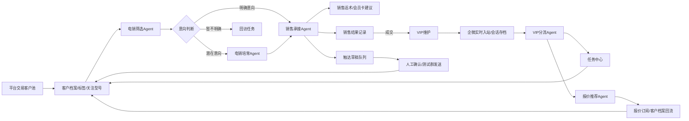
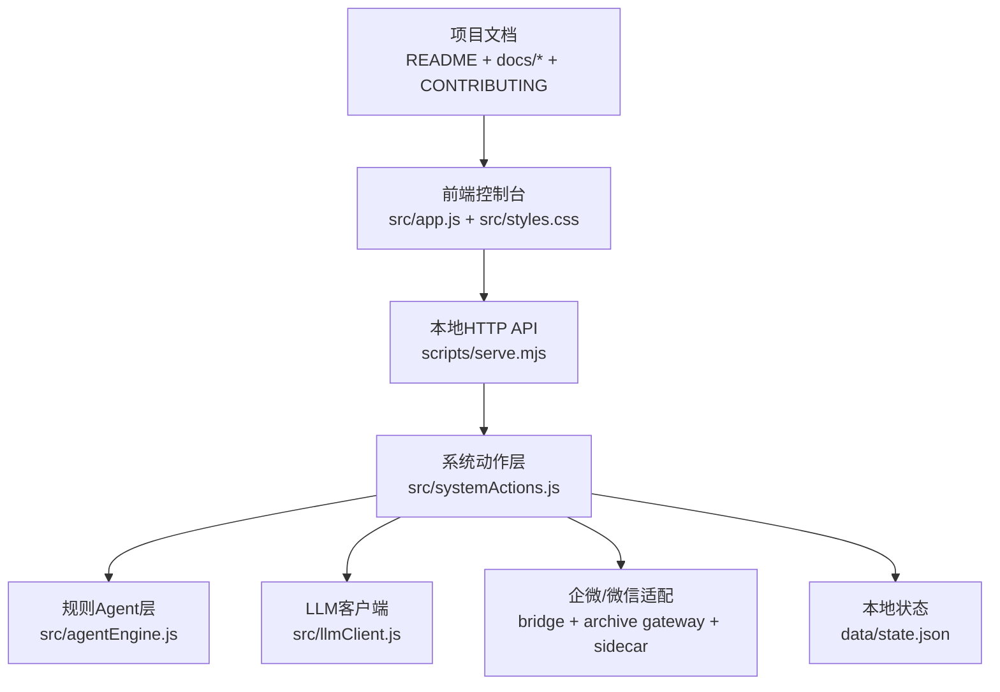

# 智能客服与客户运营中台

面向有历史交易数据的平台客户运营场景，本项目用于验证一套从“意向客户筛选、销售承接、VIP群维护、报价推送、任务闭环、数据回流”到“模型与企微客户端自动化”的一体化客户运营系统。

当前版本是 **本地可运行验证版 + 三线业务工作台版**：系统会真实写入本地客户档案、任务、报价、历史消息摘要、触达草稿、模型配置、企微配置、企微客户端实时连接器状态、企微后台群发任务、Agent运行记录和审计日志；不会真实外呼、发短信、发企微私聊或同步CRM。业务界面按电销运营、销售运营、VIP群维护组织，不再把聊天式对话窗口作为主功能。企微服务商后台下载历史消息只作为基础留档、审计、电销/销售分析和补账确认；电销群发由系统生成批次、人工审批后派发给后台浏览器企微后台执行器，执行器会自动进入企微后台客户/客户群群发入口并提交任务；实时响应只服务VIP群维护，走企微客户端本地 Worker 识别未读外部群、写入标准入站并触发 Agent。回复出站由企微员工客户端自动化 Worker 执行，只有本地动作回执和历史下载/存档回读确认后才算闭环完成；系统不生成截图、录屏或大体积证据文件。

## 目录

- [业务背景](#业务背景)
- [系统目标](#系统目标)
- [当前能力](#当前能力)
- [业务闭环](#业务闭环)
- [系统结构](#系统结构)
- [运行方式](#运行方式)
- [模型与外部连接](#模型与外部连接)
- [当前进度](#当前进度)
- [测试与质量](#测试与质量)
- [文档与协作规则](#文档与协作规则)
- [生产化边界](#生产化边界)

## 业务背景

平台已经沉淀了一批有交易体量、采购频次和具体机型偏好的客户。当前业务希望把这些客户从“可运营数据”转成“可持续推进的客户关系”，核心链路包括：

1. 电销团队筛选意向客户，判断是否需要进入销售承接或继续培育。
2. 销售团队在线承接客户，销售会员卡，并沉淀可复用销售话术。
3. 私域/VIP团队维护已购卡客户，在群里分流售前、售后、报价、投诉等问题。
4. 报价和客户偏好持续回流，形成更精准的型号推荐、触达草稿和下一步任务。

这个项目不是单点客服机器人，而是一个把客户档案、Agent、任务、报价、消息、模型配置和外部连接统一起来的客户运营中台。

## 系统目标

- 建立统一客户档案：用交易额、采购频次、关注型号、会员状态、标签和事件流维护客户画像。
- 跑通业务链路：支持电销筛选、销售承接、VIP维护、报价推荐、触达草稿和闭环编排。
- 让Agent可控：默认使用本地规则Agent稳定执行，按需调用真实LLM增强，不自动外发。
- 让外部接入可替换：测试期用企微智能机器人和测试企微群验证真实消息进入系统，生产期走企微会话存档留档、本地企微客户端实时读取和企微员工客户端自动化出站。
- 让流程可审计：所有关键动作写入任务、事件、日志和审计，避免“看起来执行了但没有记录”的假闭环。

## 当前能力

| 模块 | 已实现能力 | 当前边界 |
| --- | --- | --- |
| 客户档案 | 18个本地样例客户，全量客户档案列表优先展示，支持搜索、筛选、双击进入详情维护、新增二级页 | 未接真实交易主数据和CRM |
| 电销运营 | 电销客户池、外呼筛选Agent、电销培育Agent、历史消息/标签分析投影、客户分层、推荐群发批次、群发审批入口、企微后台群发任务派发队列 | 未接真实外呼、ASR和短信；企微后台群发执行器走专用Chrome CDP后台控制，支持客户入口和客户群入口，默认按系统确认直接提交；可用 `WECOM_ADMIN_ALLOW_SUBMIT=false` 临时关闭真实提交 |
| 销售运营 | 销售优先级任务、销售承接Agent、客户历史摘要、Agent推荐回复、销售样本库、企微应用H5工作台设计入口 | 未接企微OAuth/H5正式发布、生产级知识库、成交模型和自动质检 |
| VIP群维护 | VIP群实时读取状态、自动回复队列、高风险人工确认、群绑定、历史补账确认、VIP分流Agent、售前/售后/报价/投诉任务分流 | 图片和文件第一版占位入站并生成任务；撤回、引用回复和真实已读仍待扩展 |
| 报价订阅 | 归属VIP群管理，支持结构化报价、型号搜索、品牌/配置/库存/价格范围筛选、关注型号订阅和推荐理由 | 未接报价图片OCR和报价版本管理 |
| 触达草稿 | Agent和人工生成待确认文案，支持确认、复制、废弃、批量处理、高风险阻断 | 默认不触达客户；只有测试群Webhook会真实发送 |
| 模型配置 | 全局LLM、Agent独立LLM覆盖、ASR/TTS配置保存、OpenAI兼容连接测试、按需LLM增强 | ASR/TTS尚未真实调用；生产需密钥管理 |
| 系统设置/企微配置 | 模型配置、企微实时状态、历史消息导入/补账状态、模板风控、系统自检和开发诊断折叠入口 | 服务商历史下载只做留档/补账；实时识别和发送依赖本地企微客户端脚本，不生成截图文件 |
| 企微客户端实时连接器 | 企微员工号多群上下文、实时未读标准入站、低风险队列、高风险人工确认、人工放行、连续消息合并、SendScheduler、Worker `canReceive/canSend`能力校验、本地动作回执、失败退避、历史下载补账确认 | 未接本地脚本时只保留内部队列演练；真实读取未读、搜索群、标题校验、粘贴发送由本地企微客户端脚本完成 |
| 稳定性与审计 | 输入校验、状态自检、敏感信息脱敏、静态访问拦截、审计日志、81个自动化测试 | 本地JSON不是生产数据库 |

## 业务闭环



## 系统结构



核心数据对象：

- `CustomerProfile`：客户档案、交易数据、阶段、标签、关注型号。
- `Conversation`：本地和企微群消息上下文。
- `HandoffTask`：统一任务中心对象。
- `OutboundDraft`：待确认触达草稿。
- `ModelConfig`：全局和Agent模型配置。
- `WeComConfig` / `WeComBinding` / `WeComLog`：企微配置、群绑定和日志。
- `PersonalWechat` / `PersonalWechatSendJob`：内部兼容发送队列字段，当前由企微客户端实时Worker复用。
- `ChatSession`：从会话存档、智能机器人、企微客户端实时链路和本地调试会话投影出的统一聊天工作台会话。
- `AgentRun` / `AuditLog`：Agent输出和审计记录。

## 运行方式

安装依赖：

```bash
npm install
```

启动本地系统：

```bash
npm run dev
```

默认访问地址：

```text
http://127.0.0.1:5175
```

运行测试：

```bash
npm test
```

启动企微智能机器人长连接读取：

```bash
npm run wecom:bridge
```

启动企微会话内容存档 Gateway：

```bash
npm run wecom:archive
```

检查会话存档 Gateway 配置和 Sidecar 健康能力：

```bash
npm run wecom:archive -- --check
```

Gateway 默认先通过 `--check` 访问 Sidecar `/health` 确认 `canPull/decryptReady`，正常运行时调用 Sidecar `/pull`，成功入站后调用 `/ack`。Sidecar 负责企微会话存档 SDK、协议服务、登录态、解密、CDN文件和原始消息适配；本系统只接收标准化后的消息，并按业务线写入电销分析、销售任务或VIP群维护对应的数据投影。

只验证企微 Bot ID/Secret 是否能认证：

```bash
npm run wecom:bridge -- --check --timeout=20000
```

启动企微客户端实时未读 Worker：

```bash
npm run wecom:realtime
```

启动企微后台群发专用 Chrome：

```bash
npm run wecom:admin-chrome
```

首次运行后，在这个专用 Chrome Profile 里登录企微后台。该 Chrome 使用 `--remote-debugging-port=9222`，群发执行器通过 CDP 后台控制网页，不抢企微客户端前台窗口、鼠标、键盘或 AX。

启动企微后台群发本地执行器：

```bash
npm run wecom:admin-local
```

启动企微后台群发派发 Worker：

```bash
npm run wecom:admin-worker
```

默认情况下群发执行器会按系统确认后的 `submitMode=submit` 任务直接提交企微后台群发任务；若需要临时停用真实提交，可用 `WECOM_ADMIN_ALLOW_SUBMIT=false` 启动执行器。任务显式设置 `submitMode=dry-run` 时只做提交前验证，停在最终发送按钮前。客户入口走“群发消息给客户”，客户群入口走“群发消息到企业的客户群”。首次使用需要在专用 Chrome 中人工登录企微后台，后续执行器只复用该登录态。群发范围主筛选为部门，员工只是可选收窄条件；企微会把客户任务通知给命中客户的添加人，把客户群任务通知给命中客户群的群主。企微后台客户入口当前只能按部门/员工/标签等范围筛选，无法确认只命中单个客户时会拦截正式提交；客户群入口使用“群名关键词包含”筛选，系统会用已知群名自动生成“不发送给”排除词，例如发送给“测试群”时排除“客户测试群”。

启动本机企微客户端自动化脚本：

```bash
npm run wecom:local -- --port=8791
```

一键启动企微客户端实时收发测试环境：

```bash
npm run wecom:start
```

也可以在 macOS Finder 里双击 `start-wecom-realtime.command`。这个入口会检查 `5175` 系统服务是否已运行，未运行则自动启动；同时启动 `8791` 本地企微自动化脚本和常驻实时 Worker。测试时保持该终端窗口打开，按 `Ctrl+C` 停止本次启动的子进程。

只检查企微客户端实时 Worker 配置和健康状态：

```bash
npm run wecom:realtime -- --check
```

实时 Worker 访问本地企微客户端脚本 `/health`、`/messages`、`/send`、`/ack`。脚本只负责短 UI 动作：识别未读外部群、批量读取当前会话可见新消息、搜索群、校验标题、粘贴发送和回传结构化结果；系统负责入站去重、静默窗口、`roomVersion`、Agent决策、SendScheduler、动作日志和历史下载补账确认。本地脚本内部对 `/messages` 和 `/send` 共用串行队列锁，避免两个动作同时抢企微前台窗口。发送命令会带 `noScreenshot=true`，系统不会保存截图或录屏文件。Worker 在真正调用本地 `/send` 前会重新拉取系统状态做最终预检：任务必须仍是 `sending`、群版本未变化、静默窗口已结束、群里没有员工抢先回复；预检失败会直接取消旧任务，不占用企微窗口。本机脚本每次搜索前都会锁定企微主窗口和左上搜索框，通过 Accessibility 直接设置搜索框 value 并验证 `focused=true/value=目标名称`，避免上一次搜索残留或把内容打进聊天输入框；搜索完成前会再次重聚焦并重写搜索词，然后直接 `Enter` 进入当前第一条高亮结果，禁止先按 `Down`，进入会话后必须校验标题，发送前还会再校验一次标题。粘贴发送前会重新聚焦输入框并最多重试3次，确保输入框内容包含目标回复后才回车发送。`/messages` 会按 `cursor/knownMessageIds/ACK` 过滤系统已处理消息，返回当前系统未记录的新消息批次，并附带 `roomId/roomName/readBatchId/visibleMessageIds/returnedMessageCount` 方便审计；Worker 会优先调用 `/api/wecom-client/realtime/inbound-batch` 一次写入整批消息，单条失败不会阻断其他消息，只有成功入站的消息会 ACK。本地脚本会把 ACK messageId 和按群 cursor 持久化到小型 JSON 状态文件，重启后仍能过滤已处理消息，避免跨群 cursor 干扰和重复回传。语音、图片、文件等非文本可见项会先以占位消息入站，最终完整历史仍以服务商历史下载补账为准。没有 `expectedTitleToken` 或没有显式允许真实发送时，`/send` 不会粘贴回复或发送；搜索、标题、输入框、客户端状态失败都会返回结构化 `errorCode`。企微客户端实时链路默认静默窗口为3秒，静默等待发生在系统调度层，不占用企微窗口。

本地自动化 dry-run 会真实演练搜索和标题校验，但不会粘贴回复或发送：

```bash
curl -X POST http://127.0.0.1:8791/send \
  -H 'Content-Type: application/json' \
  -d '{"roomName":"居居","expectedTitleToken":"居居","text":"dry-run only","dryRun":true}'
```

本地运行状态保存在：

```text
data/state.json
```

`data/state.json` 已加入 `.gitignore`。前端状态接口不会返回明文API Key、企微Webhook、Bot ID 或 Secret，只返回是否已配置和掩码。

## 模型与外部连接

### LLM / ASR / TTS

- 全局LLM配置适用于所有Agent。
- 每个Agent可以单独覆盖模型；未配置时继承全局。
- 模型测试走OpenAI兼容 `chat/completions`。
- Agent默认不调用LLM；只有在模型配置页测试连接，或在Agent控制台勾选真实LLM增强时才会调用。
- ASR/TTS当前只保存连接参数，尚未接真实语音外呼执行器。

### 企微

当前企微链路分三层：

1. 会话内容存档 Gateway：生产主读取入口，对应 `npm run wecom:archive`、`/api/wecom/archive/status` 和 `/api/wecom/archive/inbound`。Sidecar最小接口为 `GET /health`、`POST /pull`、`POST /ack`。
2. 智能机器人长连接：用于真实读取企微智能机器人消息，按 `chatid` 独立归档，作为辅助/测试读取入口。
3. 测试群机器人Webhook：只用于发送测试消息和已确认草稿，不能读取群消息。

企微客户端本地脚本只暴露标准动作：脚本健康、读取未读消息、ACK、搜索会话、标题校验、粘贴发送和结构化失败回传。系统内部不直接操控业务决策，所有实时消息先转成统一 `roomId/messageId/senderType/text/source` 结构。非文本消息第一版会以占位文本写入，并生成客服人工查看任务。

### 三线业务工作台

- 电销运营：读取历史消息摘要和客户档案，做客户分层、意向标签、推荐群发批次和人工审批，不做实时回复。
- 销售运营：读取历史消息摘要和客户档案，生成销售优先级任务、客户摘要和Agent推荐回复，面向企微应用H5工作台准备数据，不自动代发。
- VIP群维护：保留企微客户端实时未读读取、自动回复队列、高风险人工确认、群绑定和历史补账，不展示完整聊天窗口。
- 审批与任务：分别留在电销、销售、VIP各自业务页内处理，不再提供全局集中页。
- 底层 `ChatSession`、企微实时入站和发送队列仍保留为数据来源，但业务界面不再把聊天式对话窗口作为主入口。

## 当前进度

| 阶段 | 状态 | 说明 |
| --- | --- | --- |
| 本地客户运营闭环 | 已可运行 | 客户、任务、报价、草稿、会话、Agent和审计能在本地闭环 |
| UI业务工作台 | 已可运行 | 左侧按总览、电销运营、销售运营、VIP群维护、客户档案、系统设置分组；审批留在各业务页 |
| LLM配置与增强 | 已可运行 | 支持真实模型连接测试和按需Agent增强 |
| 企微测试群Webhook | 已可运行 | 可把已确认草稿发送到测试群机器人 |
| 企微智能机器人长连接 | 已可运行 | 已验证普通测试群真实 @ 入站；可读取真实智能机器人消息并按 `chatid` 归档，回调窗口内真实回复会回写为会话出站消息 |
| 三线业务工作台 | 已可运行 | 电销展示分层群发并可生成企微后台派发任务，销售展示任务推荐，VIP展示实时维护队列和高风险确认 |
| 企微会话内容存档 | Sidecar主链路骨架完成 | 已固定 `/health`、`/pull`、`/ack` 契约；真实SDK/协议拉取、解密和客户同意校验由Sidecar适配 |
| 企微客户端实时收发 | Worker契约和队列闭环完成 | `canReceive=true` 后可读取未读并ACK，`canSend=true` 后才允许本地企微员工客户端执行发送；真实稳定性由本地脚本、账号数量和机器数量决定 |
| 多人协作规范 | 已建立 | PR模板、CI、CONTRIBUTING和分支规则已建立 |
| 生产化 | 待建设 | 数据库、权限、密钥管理、审批、监控、外部系统同步待补 |

## 测试与质量

当前自动化测试覆盖 81 个用例，包括：

- Agent基础业务链路。
- 任务、报价、客户、模板输入校验。
- 模型配置、LLM连接测试和LLM增强边界。
- 企微Webhook、智能机器人入站、会话存档入站、消息去重和机器人出站回写幂等。
- 三线业务工作台、客户绑定、VIP回复入队和高风险人工确认。
- 企微客户端实时Worker能力声明、AccountAgent兼容队列、健康检查、接收/ACK字段、确认回执ACK、重复回读确认幂等、人工放行、SendScheduler、本地动作回执、失败退避和回读确认。
- 状态自检、能力审计、脏数据恢复和安全边界。

常用检查：

```bash
npm test
node --check src/app.js
node --check src/systemActions.js
node --check scripts/serve.mjs
node --check scripts/wecom-archive-gateway.mjs
node --check scripts/personal-wechat-send-gateway.mjs
```

GitHub Actions 会在 Pull Request 和 `main` 推送时运行 `npm test`。

## 文档与协作规则

主要文档：

- [完整使用文档](docs/USAGE_GUIDE.md)
- [贡献与版本发布规范](CONTRIBUTING.md)
- [项目说明](docs/PROJECT.md)
- [系统架构](docs/ARCHITECTURE.md)
- [API 文档](docs/API.md)
- [当前系统能力审计](docs/CAPABILITY_AUDIT.md)
- [稳定性审计](docs/STABILITY_AUDIT.md)
- [测试与验收](docs/TESTING.md)
- [变更记录](docs/CHANGELOG.md)

README 是项目首页，也是外部协作者理解系统的第一入口。只要更新涉及以下任一内容，就必须同步检查并更新 README：

- 业务背景、系统目标或业务流程变化。
- 新增、删除或改变核心模块能力。
- 新增外部连接、模型配置、Agent能力或发送边界。
- 运行方式、测试方式、端口、脚本或数据位置变化。
- 当前进度、生产化边界或项目文档入口变化。

每次功能更新还必须同步维护对应专题文档：

- 使用方式变化：更新 `docs/USAGE_GUIDE.md`。
- 架构或数据流变化：更新 `docs/ARCHITECTURE.md`。
- API变化：更新 `docs/API.md`。
- 能力边界变化：更新 `docs/CAPABILITY_AUDIT.md`。
- 稳定性和风险变化：更新 `docs/STABILITY_AUDIT.md`。
- 测试变化：更新 `docs/TESTING.md`。
- 所有可见能力变化：更新 `docs/CHANGELOG.md`。

协作流程见 [CONTRIBUTING.md](CONTRIBUTING.md)。`main` 代表最新稳定版本，所有更新必须通过独立分支和Pull Request合并。

## 生产化边界

当前版本适合做本地产品验证、流程演示、Agent能力测试、企微客户端自动化接入方案验证和多人协作开发。

进入生产前仍需补足：

- 真实外呼平台、ASR、TTS、录音和通话质检。
- 短信、企微私聊、CRM和交易系统同步。
- 企微会话内容存档真实拉取、消息解密、客户同意校验、`/ack`游标确认和权限审计。
- 企微客户端自动化的生产登录态、收发稳定性、自回显监听、账号风控和人工审批。
- 生产数据库、迁移、备份、权限、密钥管理、监控和告警。
- LLM知识库、内容安全、成本统计、调用日志和模型评估。
