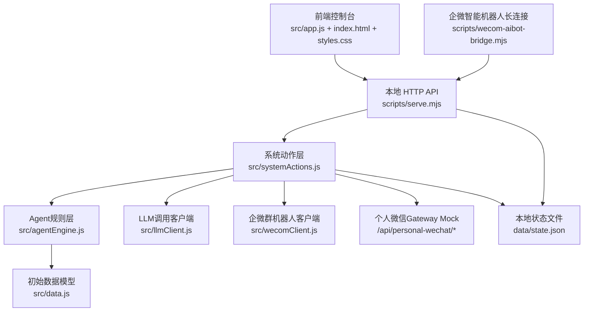
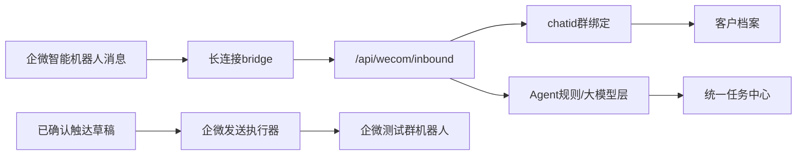

# 系统架构

## 分层结构

## 核心数据对象

- `CustomerProfile`：客户档案、交易数据、意向分、阶段、会员状态、关注型号、标签；初始样例客户池包含18个客户，覆盖多阶段和多机型测试场景。
- `Conversation`：本地会话窗口，保存客户、渠道、群成员、消息、发送角色和@对象。
- `Event`：客户相关事件流，包括外呼摘要、私聊回复、VIP群提问、任务更新、报价行为。
- `HandoffTask`：统一任务中心对象，承接销售、私域、客服、售后、主管等角色，并记录SLA、截止时间、升级状态和完成时间。
- `Template`：自动触达模板及风控状态。
- `QuoteItem`：结构化报价项，支持客户订阅和报价推荐。
- `SalesSample`：销售话术样本，记录场景、阶段、卡种、异议、结果、质检分和可复用话术。
- `OutboundDraft`：本地触达草稿，保存客户、渠道、来源Agent、文案、优先级、状态和外部副作用边界。
- `ModelConfig`：模型连接配置对象，包含全局LLM API URL/API Key/模型名、ASR/TTS语音模型和各Agent独立LLM覆盖；Agent覆盖为空时继承全局配置。
- `WeComConfig`：企微连接配置，保存测试群机器人Webhook发送路由、智能机器人 Bot ID/Secret、长连接状态、默认入站渠道和本地入站设置。前端公开状态只返回是否配置和掩码。
- `WeComBinding`：企微群绑定表，按 `chatid` 记录群名、客户档案、业务渠道、消息数、最近消息和绑定状态；未知群首次入站会生成待绑定客户群档案，避免不同客户群消息混档。
- `WeComLog`：企微测试发送、草稿发送、智能机器人入站、桥接状态和去重记录，包含成功/失败、路由、客户、草稿、`chatid`、`msgid`、耗时、错误和是否触发外部发送。
- `PersonalWechat`：个人微信单账号 AccountAgent 配置，保存账号、群上下文、回复决策、发送队列和运行日志；当前 Gateway 为本地 Mock。
- `PersonalWechatGroupContext`：按 `roomId` 保存外部群名、客户绑定、最近消息、最近回复、最近员工回复和待发送任务，避免不同外部群串话。
- `AccountAgentDecision`：保存触发消息、动作 `ignore/auto_reply/require_approval/create_task`、回复文本、风险等级和判断理由。
- `PersonalWechatSendJob`：保存单账号发送任务、触发消息、回复文本、状态、发送/确认时间和确认回显消息ID；同账号串行、同群只保留一个活跃任务。
- `WorkflowPlan`：闭环编排Agent生成的客户下一步动作、渠道、负责人、成功指标和任务建议。
- `AgentRun`：最近 Agent 输出，用于运营复盘和前端展示；包含 `modelConfig` 生效连接配置和 `execution` 执行边界。
- `AuditLog`：服务端关键动作审计。

## 前端展示原则

前端控制台面向销售、运营和本地测试人员，不要求业务用户理解代码或 JSON。`AgentRun` 原始结果只作为内部状态保存；总览、Agent控制台、销售学习和本地消息页会把结果转换为客户判断、建议动作、话术草稿、推荐报价、触达草稿、任务和执行边界等业务化卡片。

总览系统蓝图由页面内结构化流程图渲染，明确展示客户池、电销筛选、培育沉淀、销售承接、VIP维护、数据回流，以及客户档案、任务中心、触达草稿、报价库和模型配置等共享底座。

总览同时提供电销/销售角色工作台，从客户阶段和任务角色两个维度聚合优先客户与待办任务，并跳转到对应客户池或任务中心筛选结果。

## 写入一致性

`scripts/serve.mjs` 使用 `mutationQueue` 串行化所有状态写入，避免多个前端动作同时写 `data/state.json` 时互相覆盖。队列支持异步动作，因此真实LLM增强会在同一套写入顺序中完成并回写运行结果。

静态文件服务会拒绝直接访问 `data/` 目录和隐藏文件，避免绕过 API 读取本地状态文件。

前端读取的 `/api/state` 是脱敏后的公开状态：模型 API Key、企微Webhook、Bot ID 和 Secret 不会返回明文，只保留是否已配置和掩码。模型配置保存时空Key表示保留旧密钥，只有显式 `clearApiKey` 才会清除；企微Webhook和智能机器人凭据同理，输入框留空会保留旧值，勾选清空才删除。

写入流程：

1. API 接收请求。
2. `mutateState` 读取当前 `data/state.json`。
3. 系统动作层返回下一份完整状态。
4. 服务端写回 JSON。
5. 前端使用返回状态重新渲染。

`cloneState` 会补齐缺失的集合字段，例如 `tasks`、`events`、`quotes`、`agentRuns`，降低手工修改 `data/state.json` 或旧版本数据迁移造成的运行中断风险。

## Agent协作

- 外呼筛选Agent：根据交易额、采购频次、最近交易、会员状态和标签评分，决定进入销售、培育或回访。
- 电销培育Agent：识别私聊消息意图，判断是否升级销售承接。
- 销售承接Agent：识别会员卡咨询、报价异议和人工跟进需求，并引用高质量销售样本生成话术建议。
- VIP群分流Agent：读取本地会话窗口，识别售后、投诉、报价、财务等问题，结合@对象、重复问题和未结任务生成角色任务。
- 报价推荐Agent：根据客户关注型号和标签推荐结构化报价。
- 闭环编排Agent：扫描全部客户，生成下一步动作、任务、交接摘要和成功指标。
- 模型连接解析：运行Agent时读取 `ModelConfig`，把本次生效的供应商、API URL、模型名、Key是否已配置、温度、输出Token和来源写入 `AgentRun.modelConfig`；前端会把温度解释为回答稳定/发散程度。
- 真实LLM调用：`src/llmClient.js` 支持OpenAI兼容 `chat/completions`，模型配置页可测试连接，Agent控制台勾选真实LLM增强时会发送客户摘要、当前消息和本地Agent结果。
- 执行边界记录：默认Agent由本地规则引擎执行，`AgentRun.execution.modelInvocation` 为“未调用”；真实LLM增强成功时记录“已调用”，失败时记录“调用失败”或“配置缺失”。Agent运行本身的 `externalSideEffects` 始终为 `false`，避免把模型调用误认为外呼、短信、企微或CRM动作。
- 触达草稿生成：面向明确客户的Agent运行会把可执行文案写入 `OutboundDraft`；人工也可新增草稿。草稿确认、复制、处理和废弃只更新本地状态，不触发外部发送。
- 企微草稿发送：只有 `已确认` 草稿可以调用 `/api/outbound-drafts/:draftId/send-wecom`。成功后草稿状态更新为 `企微已发送`，`externalSideEffects=true`，写入 `wecomDelivery`、客户事件、`WeComLog` 和审计。普通草稿状态接口不能伪造 `企微已发送`。
- 企微长连接入站：`scripts/wecom-aibot-bridge.mjs` 使用 `@wecom/aibot-node-sdk` 连接 `wss://openws.work.weixin.qq.com`，认证成功后监听企微智能机器人消息，把 `chatid`、`msgid`、`req_id`、发送人和文本内容写入 `/api/wecom/inbound`。
- 企微入站适配：`/api/wecom/inbound` 同时支持本地模拟和长连接真实入站。系统先按 `externalMessageId/msgid` 去重，再按 `chatid` 查找群绑定；未知群自动生成待绑定档案，之后写入本地 `Conversation` 并路由到电销、销售或VIP Agent。
- 个人微信单账号入站：`/api/personal-wechat/inbound` 当前模拟 PersonalWechatGateway 收到外部群消息。系统按 `messageId` 去重，按 `roomId` 更新 `PersonalWechatGroupContext`，再由单个 `AccountAgent` 生成 `AccountAgentDecision`；低风险内容进入 `queued`，高风险内容进入 `manual_required`，员工或托管号消息会取消同群待发。
- 个人微信发送确认：`/api/personal-wechat/send-jobs/:jobId/confirm` 当前模拟发送成功后的自回显或企微存档回读确认。确认前先执行 `maxQueueAgeSeconds` 过期重判和 `minSendIntervalSeconds` 单账号限频；通过后把 `PersonalWechatSendJob` 标记为 `confirmed`，并写入本地 `VIP模拟群` 会话、客户事件和运行日志。生产接入真实 Gateway 后，仍复用这条确认闭环。
- 批量任务处理：任务中心的批量跟进中/完成调用 `/api/tasks/batch-status`，逐条复用任务状态更新逻辑，写入客户事件、完成时间和汇总审计。
- 批量草稿处理：触达草稿队列的批量确认/处理/废弃调用 `/api/outbound-drafts/batch-status`，逐条写入状态时间、客户事件和汇总审计，并保持 `externalSideEffects=false`。
- 草稿风险边界：前端按草稿内容识别投诉、赔偿、退款、锁价、付款等高风险文案，高风险草稿需要单条复核，不能批量确认。
- 审计摘要：Agent运行审计记录保存业务摘要，前端对旧版 JSON 详情会尽量转换为人可读摘要，避免业务页面出现内部数据结构。
- 展示隔离：Agent控制台和本地消息页会按当前客户过滤Agent结果，避免销售建议或VIP分流上下文串到其他客户。
- 任务SLA巡检：扫描未完成任务，计算正常、临期、超时和已完成状态，将超时未升级任务转给主管队列并写入审计日志。

## 能力审计

`buildCapabilityAudit` 会把当前系统能力拆成：

- 本地可用：功能会真实写入本地状态，可完成本地工作台闭环。
- 可运行：具备运行入口，执行后会生成本地结果。
- 待建设：需要补足数据或规则后才能形成稳定能力。
- 未接入：需要外部系统适配。

## 系统自检

`diagnoseState` 会检查：

- 是否存在客户档案。
- 当前选中客户是否有效。
- 任务是否都引用真实客户。
- 任务是否都有有效创建时间和截止时间。
- 任务负责人角色是否属于电销、销售、私域、客服、售后、主管或运营。
- 事件是否都引用真实客户。
- 事件是否都有渠道、类型和正文。
- 会话是否都引用真实客户，会话消息是否有发送角色和正文。
- 报价型号和价格是否有效。
- 报价型号配置是否重复。
- 销售样本是否有有效阶段、结果、质检分和话术。
- 模型配置是否有有效全局LLM API URL和模型名，Agent独立覆盖是否能解析为生效模型，ASR/TTS语音模型配置是否可解析。
- Agent运行记录是否标明本地执行边界和外部副作用状态。
- 触达草稿是否引用真实客户，渠道/状态/正文是否合法；普通草稿外部副作用必须为 `false`，企微已发送草稿必须带有效 `wecomDelivery`。
- 企微连接配置是否可解析，智能机器人凭据、群绑定、发送路由、Webhook配置状态和企微日志是否可追踪。
- 个人微信 AccountAgent 配置是否可解析，群上下文是否按 `roomId` 唯一，发送队列是否引用真实群上下文，同一群是否只有一个活跃待发任务。
- 模板风险配置是否有效。
- 高风险模板是否被自动放行。
- 审计日志是否存在。

## 企微接入位置

当前已接入两条企微链路：智能机器人长连接用于读取真实消息并按 `chatid` 独立归档；测试群机器人Webhook用于发送测试消息和已确认草稿灰度推送。后续生产级企微接入时，需要在当前长连接基础上补齐客户联系、通讯录、权限、审批、幂等、失败重试和合规审计。

## 个人微信单账号 AccountAgent

当前实现用于验证“一个个人微信号加入多个外部群，一个账号只绑定一个 AccountAgent”的产品链路。真实 Gateway 接入前，前端和 API 提供 Mock 入站与 Mock 发送确认。

```mermaid
flowchart LR
  Room["企微外部VIP群"] --> Gateway["PersonalWechatGateway Mock"]
  Gateway --> Inbound["/api/personal-wechat/inbound"]
  Inbound --> Context["GroupContextManager<br/>按roomId隔离"]
  Context --> Agent["AccountAgent<br/>单账号单Agent"]
  Agent --> Policy["ReplyPolicy<br/>低风险/高风险"]
  Policy --> Queue["SendQueue<br/>单账号串行"]
  Queue --> Confirm["/api/personal-wechat/send-jobs/:id/confirm"]
  Confirm --> Echo["自回显/企微存档确认"]
```

运行规则：

- 一个个人微信账号只对应一个 `AccountAgent` 和一个发送队列。
- Agent 可同时维护多个群上下文，但发消息必须按账号串行。
- 同一外部群同一时间只保留一个活跃待发送任务。
- 低风险消息自动排队，高风险消息进入人工确认。
- 员工或托管号已回复时，取消同群待发送任务。
- 超过队列过期秒数的任务会取消，要求重新判断。
- 同账号连续发送未满足最小间隔时，任务保持待发送并提示限频等待。
- 所有自动回复都记录触发消息、判断理由、回复内容和发送确认结果。
