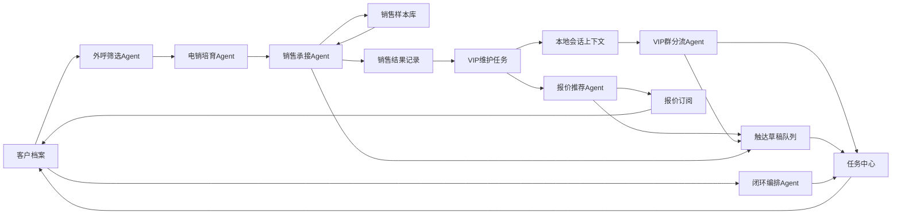

# 当前系统能力审计

## 总体判断

当前系统已经可以实现“本地可运行客户运营闭环”：客户档案、事件流、任务中心、报价订阅、Agent输出和审计日志都在同一个本地状态中流转，能跑通电销筛选、销售承接、VIP分流、报价推荐和闭环编排。

但它还不是生产级智能客服系统。真实外呼、短信、交易系统、CRM、人员排班、客户联系加好友回调、企业通讯录和生产级权限策略仍未接入。企微已经支持测试群机器人Webhook发送、本地入站适配和智能机器人 WebSocket 长连接读取；个人微信单账号 AccountAgent 已完成 Mock 入站、风控决策、单账号队列和发送确认闭环；LLM已支持OpenAI兼容连接测试和Agent按需增强，但还没有生产级内容安全、成本统计、知识库版本控制和权限审批。当前更准确的定位是：本地工作台真实可用，企微智能机器人长连接已认证可用，个人微信链路可做内部闭环验证，生产级外部触达和系统集成仍需继续建设。

## 能力分层结论

| 环节 | 当前状态 | 已能实现 | 不完善/未实现 |
| --- | --- | --- | --- |
| 平台客户档案 | 本地可用 | 本地CustomerProfile保存交易额、频次、阶段、意向分、标签、关注型号，改动会写入本地状态 | 未接真实交易系统、客户去重、主数据治理 |
| 电销外呼筛选 | 本地可用 | 外呼筛选Agent按交易数据评分，真实更新客户阶段、标签、事件和任务 | 无真实语音外呼、ASR、短信、企微活码；只生成待执行任务 |
| 电销培育 | 本地可用 | 可处理本地私聊入站，识别报价/会员/售后意图并升级销售任务 | 无批量群发、触达频控、真实企微会话历史 |
| 模型连接配置 | 配置可用 | 可配置全局LLM API URL、API Key、模型名、ASR/TTS语音模型和各Agent独立LLM覆盖，Agent未配置时继承全局，并可测试LLM连接；前端状态不返回明文Key，空Key保存会保留旧Key，支持显式清空 | ASR/TTS尚未真实调用；API Key仍是本地文件保存，生产需迁移到密钥管理 |
| 企微连接器 | 长连接待运行/配置可用 | 可保存企微智能机器人 Bot ID/Secret 并脱敏展示；bridge 使用 WebSocket 长连接读取消息，按 `chatid` 独立归档客户群，按 `msgid` 去重；同时支持测试群机器人Webhook发送测试消息和已确认草稿 | 已打通智能机器人消息入口；仍未接客户联系加好友回调、企业通讯录、成员私聊全量同步、生产权限策略和发送审批 |
| 个人微信 AccountAgent | Mock可运行 | 单个人微信账号对应一个 AccountAgent 和一个发送队列；可按 `roomId` 维护多个外部群上下文，低风险自动排队，高风险人工确认，重复消息去重，员工回复取消待发，发送确认时执行队列过期重判和账号限频 | 当前未接真实个人微信登录、收发、掉线重连、自回显监听、生产限频退避和合规审批 |
| Agent销售工作台 | 本地可用 | Agent控制台按客户摘要、常用消息、业务动作、客户判断、话术草稿、报价推荐和待办展示，不要求销售理解代码或 JSON | 尚未接权限分层、个人工作台和真实发送确认流 |
| 销售承接 | 本地可用 | 可输出销售交接包、推荐卡种、异议处理、成交建议并生成任务；可勾选真实LLM增强生成本地增强草稿 | 无生产级LLM知识库、成交概率模型、人工确认流 |
| 销售技巧迭代 | 本地可用 | 已有销售样本库、质检分、异议点和可复用话术，销售Agent会引用高分成交样本 | 缺少真实会话导入、自动质检、A/B策略回流和模型训练 |
| VIP群分流 | 本地可用/长连接入站可用 | 可读取本地会话窗口，识别售后、投诉、报价、客服，判断@错人、重复问题和未结任务；企微长连接消息按 `chatid` 进入对应客户群档案，前端按当前客户展示VIP上下文，避免串客户 | 仍缺图片/文件下载入库、撤回、引用回复、群成员权限和生产级群绑定审批 |
| 报价订阅 | 本地可用 | 结构化报价、型号搜索、品牌/配置/库存/价格范围筛选、型号订阅、推荐理由、触达文案生成 | 无报价图片解析、版本管理、真实访问行为统计 |
| 任务中心 | 本地可用 | 销售、售后、客服、私域任务统一承接，支持组合筛选、批量状态更新、SLA截止、超时巡检和主管升级 | 无人员排班、真实提醒推送、关闭质检 |
| 触达草稿队列 | 本地可用 | Agent和人工可生成待确认触达草稿，支持组合筛选、风险识别、确认、复制、发送企微测试群、批量处理、人工已处理、废弃 | 企微测试群可发送；短信、外呼、企微私聊和CRM仍需后续执行器 |
| 闭环编排 | 本地可用 | 为所有客户生成下一步动作、渠道、负责人、任务、成功指标 | 不会真正执行短信/外呼/企微私聊/CRM发送 |
| 大模型执行器 | 可运行/待配置 | 支持OpenAI兼容 `chat/completions` 连接测试，Agent可按需调用真实LLM增强建议并生成本地草稿 | 仍缺内容安全、成本监控、调用日志、知识库版本控制和权限审批 |
| 外部触达执行器 | 半闭环/未接入 | 配置Webhook后，已确认草稿可发送到企微测试群机器人；其他动作只生成本地任务和文案 | 未接真实外呼、短信、企微私聊、官方客户群回调、CRM写入 |
| 系统集成 | 未接入 | 保留适配层设计 | 企微、CRM、交易系统、短信、外呼平台均未接入 |

## 本轮已补足的闭环能力

- 新增“闭环编排Agent”：为每个客户生成下一步动作、推荐渠道、负责人角色、任务标题、成功指标和推荐话术。
- 新增“能力审计”：接口和页面都能展示哪些能力是本地可用、可运行、待建设或未接入。
- 销售承接Agent增强：输出 `handoffPackage`、`playbook`、报价推荐、异议处理和成交建议。
- 销售学习增强：新增销售样本库，支持录入成交/培育话术、质检分和适用标签，销售承接Agent会引用匹配样本。
- VIP群分流Agent增强：读取离线会话上下文，识别客户@了谁、应该转给谁、是否@错人、是否重复提问以及是否已有未完成任务。
- 报价推荐Agent增强：输出推荐理由和可触达文案。
- 销售结果增强：成交后自动创建“成交客户建立VIP维护小群”任务；继续培育会回到电销触达任务。
- 任务中心增强：任务自动补齐创建时间和截止时间，SLA报表能统计临期、超时、升级和已完成任务，超时巡检可升级到主管队列。
- 任务中心P0增强：支持搜索、角色、负责人、状态、优先级和SLA组合筛选，并提供批量跟进中/完成接口和界面。
- 模型连接配置增强：支持全局LLM API URL/API Key/模型名、ASR/TTS语音模型、Agent独立覆盖、空覆盖继承全局，Agent运行记录会写入生效连接配置和执行边界。
- 模型密钥稳定性增强：`/api/state` 脱敏API Key，空Key保存保留旧密钥，`clearApiKey` 才清空。
- 模型配置可解释性增强：模型配置页补充“温度”含义，说明低温更稳定保守、高温更发散，并提示客服/销售建议区间。
- 真实LLM调用增强：新增OpenAI兼容调用客户端、模型连接测试接口和Agent按需LLM增强；成功后会生成本地增强草稿，失败时保留本地规则结果。
- 客户池增强：初始模拟客户扩充到18个，并在客户旅程和客户管理页增加搜索、阶段、会员状态和负责人筛选。
- 触达草稿队列增强：Agent运行后会生成本地待确认触达文案，人工也可新增草稿，并可在本地完成确认、复制、人工已处理或废弃状态管理。
- 触达草稿P0增强：支持搜索、状态、渠道、优先级和风险筛选；高风险文案阻止批量确认，批量处理仍会逐条写事件和审计。
- 批量本地Agent增强：按当前客户阶段批量运行本地规则Agent，并生成闭环编排。
- 前端可用性增强：总览系统蓝图改为结构化流程图；Agent控制台、销售学习、本地消息和总览审计日志不再展示原始JSON，统一转成业务摘要和卡片。
- 展示隔离增强：Agent控制台和本地消息VIP上下文按当前客户过滤，避免跨客户误用建议。
- 角色工作台增强：总览新增电销/销售工作台，按客户阶段和任务角色展示优先客户、待办任务，并可跳转到对应筛选页。
- 报价查询增强：报价页支持型号搜索、配置、库存和价格范围筛选，便于替代图片报价单做结构化测试。
- 导航信息架构增强：左侧一级菜单按总览、客户管理、电销管理、销售管理、群聊管理和设置收拢，二级菜单放置对应业务页面，并为电销客户池、任务和群触达草稿提供业务预设筛选。
- 企微P1/P2增强：新增企微接入页、`WeComConfig`、`WeComBinding`、`WeComLog`、测试发送、已确认草稿发送、企微模拟入站、智能机器人长连接 bridge、Webhook/Bot ID/Secret 脱敏、`chatid` 独立归档、`msgid` 去重和自检校验。
- 个人微信单账号 AccountAgent 增强：新增 `PersonalWechat` 状态、Mock 入站接口、发送确认接口、群上下文、回复决策、发送队列和日志；验证“一个账号一个Agent、同账号串行发送、同群只保留一个待发、超时重判、限频等待”的核心约束。

## 仍然不能宣称已实现的能力

- 真实智能外呼：没有语音通话、录音、ASR、打断、多轮外呼对话。
- 真实短信/企微引导：没有短信供应商、企微活码、好友添加回调。
- 真实企微群助手：智能机器人长连接已经可以作为消息入口读取真实机器人会话，并按 `chatid` 独立归档；但文件/图片下载入库、撤回、引用回复、群成员权限、客户联系回调和生产级审批仍未完成。
- 真实个人微信托管号：当前只是 Mock Gateway，可验证系统内部 AccountAgent 和队列；还没有接入个人微信真实登录、收消息、发消息、自回显监听、掉线重连和生产风控。
- 大模型客服能力：已有真实LLM连接测试和按需增强，但默认Agent仍先跑本地规则；尚无RAG知识库、模型安全护栏、成本监控和ASR/TTS真实调用。
- 自动触达发送：触达草稿队列只做本地确认和状态管理；已确认草稿可发送企微测试群，但不会真实发送短信、企微私聊、外呼或CRM动作。
- 销售技巧自动学习：当前已有人工样本库和Agent引用，但还没有真实会话自动导入、自动质检评分和A/B策略回流。
- 报价图片结构化：当前报价是手动结构化数据，不支持图片OCR和版本对比。
- 权限与合规：没有角色权限、敏感词审核、操作审批、真实审计归档。
- 任务执行闭环：任务能生成、更新、统计SLA并做超时主管升级，但没有人员排班、真实提醒推送和关闭质检。

## 目前已跑通的本地流程

## 下一阶段建议

1. 接企微前，继续扩展离线消息模型：消息类型、附件、引用回复、撤回、图片和文件。
2. 引入真实知识库前，继续补“销售话术样本导入、质检评分规则和A/B结果回流”。
3. 企微下一步优先做官方回调只读同步、消息幂等和人工确认审批；测试群机器人发送继续保留为灰度验证入口。
4. 报价模块下一步做报价版本、批量导入和图片OCR。
5. 任务中心下一步做负责人排班、提醒推送、关闭原因和关闭质检。
