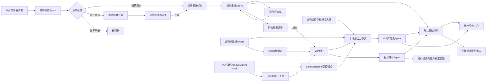

# 项目说明

## 项目定位

本项目是“智能客服与客户运营中台”的本地可运行版。当前阶段使用本地 API、JSON 状态存储、本地消息入口、触达草稿队列、企微会话内容存档标准化入站、企微智能机器人长连接/测试群机器人连接器、个人微信单账号 AccountAgent + SendScheduler Mock 队列和规则型 Agent，把从客户筛选到销售承接、VIP维护、报价订阅和数据回流的业务链路跑通。系统会真实写入本地状态；不会真实外呼、发短信或同步CRM。默认Agent不调用外部大模型，只有模型连接测试或勾选真实LLM增强时才会调用已配置模型；配置企微Webhook后，人工确认草稿可以真实发送到企微测试群机器人；启用会话存档入口后，可以用标准化入站接口验证存档消息读取、去重和群归档；配置智能机器人 Bot ID/Secret 并启动 bridge 后，可以读取真实企微智能机器人消息并按 `chatid` 独立归档客户群；个人微信链路当前用于验证单账号多外部群上下文、风控决策、受控发送调度和回读确认。

## 当前可运行链路

## 已实现模块

- 总览：核心指标、端到端链路、电销/销售角色工作台、页面内结构化系统蓝图、最近 Agent 输出摘要、审计日志。
- 侧边导航：按总览、客户管理、电销管理、销售管理、群聊管理、设置组织一级模块，并在二级菜单下放置对应业务页面。
- 客户旅程：状态机、客户池、客户 360 简档、事件流，支持搜索和阶段/会员/负责人筛选。
- 客户管理：新增客户、维护标签/关注型号/阶段/负责人、记录销售结果，客户列表支持搜索和筛选。
- Agent 控制台：面向销售和运营使用的Agent工作台，展示客户摘要、常用客户消息、业务动作、客户判断、建议话术、推荐报价、触达草稿和后续待办，不展示原始代码或 JSON。
- 模型配置：配置全局 LLM API URL、API Key、模型名、温度和输出Token，配置ASR/TTS语音模型，并支持各Agent独立LLM覆盖；温度表示回答稳定/发散程度，支持真实LLM连接测试和Agent按需LLM增强，ASR/TTS当前仍只保存连接参数。
- 企微接入：保存企微会话内容存档入口、企微智能机器人 Bot ID/Secret，启动长连接 bridge 读取真实消息，按 `chatid/roomId` 独立归档客户群并维护群绑定；同时保留测试群机器人Webhook发送测试消息、已确认草稿灰度推送和个人微信单账号 AccountAgent + SendScheduler Mock 队列。Webhook、Bot ID、Secret和入站Secret不在前端明文展示。
- 销售学习：沉淀成交/培育话术样本、质检分、异议点和适用卡种，供销售承接Agent引用。
- 本地消息：写入电销私聊、销售私聊、VIP群本地消息，沉淀本地会话窗口并展示群成员、消息和@对象。
- 触达草稿：Agent和人工可生成待确认触达文案，支持搜索、状态/渠道/优先级/风险筛选、确认、复制、发送企微测试群、批量处理、人工已处理和废弃；只有企微发送成功会写入外部副作用。
- 任务中心：统一承接销售线索、售后分流、报价咨询和人工任务，支持搜索、角色/负责人/状态/优先级/SLA筛选、批量状态更新、SLA截止、临期/超时识别、主管升级和完成时间回写。
- 报价订阅：结构化报价维护、型号搜索、品牌/配置/库存/价格范围筛选、型号订阅、报价行为回流。
- 闭环编排：能力审计、客户下一步动作、触达渠道、负责人、成功指标和任务生成。
- 模板与风控：模板启停、高风险模板禁用展示。
- 系统自检：检查客户、任务、事件、报价、模板、审计日志的状态一致性。

## 本轮新增能力

- 增加 `/api/diagnostics` 系统自检接口。
- 增加前端“系统自检”页面和顶部“运行系统自检”按钮。
- 增加客户、任务、报价、模板等输入边界校验。
- 增强前端 API 错误解析，用户会看到明确错误原因。
- 扩充测试到 52 个用例，覆盖正常链路、异常输入、脏数据、销售学习、会话上下文、闭环编排、任务SLA、任务批量处理、触达草稿批量处理、状态集合缺失恢复、LLM/语音模型配置、API Key保留/清空、真实LLM连接测试、Agent执行边界、企微配置脱敏、企微测试发送、企微草稿发送、企微模拟入站、会话存档标准入站、智能机器人凭据脱敏、按 `chatid/roomId` 独立建档、`msgid/messageId` 去重，以及个人微信单账号 AccountAgent 低风险队列、高风险人工确认、连续消息合并、SendScheduler调度、失败退避、队列过期取消和分钟限频。
- 完善界面展示逻辑：空客户/加载失败保护、操作中禁用、防重复提交、报价筛选保持、移动端按钮堆叠展示。
- 优化界面排版和展示逻辑：顶部操作区固定、移动端导航按业务分组折叠、表格表头稳定、Agent建议区可视内滚动、系统蓝图减少窄列挤压。
- 修复Agent控制台输出串客户风险：AgentRun记录客户归属，控制台只展示当前客户对应的最新Agent建议。
- 修复本地消息VIP上下文串客户风险：VIP分流结果按当前客户过滤，切换客户后不会展示其他客户的群分流摘要。
- 增加临时 CDP UI smoke 验收方式，真实点击导航、自检、批量本地Agent、本地消息入站、报价订阅和任务状态更新。
- 增加能力审计与闭环编排：识别本地可用、可运行、待建设和未接入能力，并为所有客户生成下一步运营动作。
- 增强销售、VIP和报价Agent：销售交接包、话术playbook、@错人纠偏、报价推荐理由和触达文案。
- 增加稳定性审计与防脏数据校验：非法阶段、客户风险、任务状态、任务优先级、销售结果会被拒绝写入，重复报价按自然键更新，自检覆盖更多脏状态。
- 增加销售学习闭环：新增销售样本库、`/api/sales-samples` 接口、前端“销售学习”页，销售承接Agent会引用高分成交样本生成话术建议。
- 增加本地会话上下文：消息入站会写入 `Conversation`，VIP群分流Agent会读取最近群消息、@对象和未完成任务，判断重复问题并升级优先级。
- 增加任务SLA闭环：任务自动补齐创建时间和截止时间，`/api/tasks/sla` 输出临期/超时/完成统计，`/api/tasks/escalate` 可将超时未完成任务升级到主管队列。
- 增加稳定性补强：状态集合缺失时自动恢复为空数组，非法负责人角色/发送角色/坏SLA参考时间会被拒绝，自检会发现坏SLA时间和异常事件，静态服务不再直接暴露 `data/state.json`。
- 增加模型连接配置中心：`modelConfig` 支持全局 LLM、ASR/TTS语音模型和Agent独立LLM覆盖，字段包含 API URL、API Key、模型名、温度和输出Token，并在Agent输出中记录生效连接配置。
- 增加模型密钥保护：`/api/state` 返回前端状态时脱敏 API Key；模型配置页留空Key会保留旧Key，勾选“清空已保存Key”才会清除。
- 增加模型温度解释：模型配置页把温度说明为“越低越稳定保守，越高越发散”，并给出销售/客服建议区间。
- 增加真实LLM连接测试：新增OpenAI兼容 `chat/completions` 调用客户端和 `/api/model-config/test`，可验证全局或指定Agent生效模型配置。
- 增加Agent按需LLM增强：Agent控制台可勾选真实LLM增强，系统会先运行本地规则Agent，再把客户摘要、当前消息和本地结果发送到配置的LLM生成增强建议，并写入本地增强草稿。
- 重做总览系统蓝图：从静态方案图片改为页面内结构化流程图，展示客户池、电销筛选、培育沉淀、销售承接、VIP维护、数据回流和底层共享能力。
- 重做Agent控制台展示：从原始运行对象改为销售可读的业务卡片，展示判断、下一步、话术草稿、推荐报价、触达草稿和任务，不再要求销售理解代码或 JSON。
- 去除业务页面代码化输出：总览、Agent控制台、销售学习、本地消息VIP上下文和审计日志均改为业务摘要或卡片展示。
- 增加Agent执行边界记录：`AgentRun.execution` 明确记录本地规则引擎、真实LLM是否调用、外部触达副作用未触发和被阻断的外部动作。
- 增加触达草稿队列：新增 `outboundDrafts` 状态、`/api/outbound-drafts` 相关接口和前端“触达草稿”页，Agent与人工都可生成待确认文案，状态流转全程不触发外部发送。
- 扩充模拟客户池：初始样例客户从6个扩充到18个，覆盖更多阶段、会员状态、交易体量、负责人和关注型号。
- 增加客户池筛选：客户旅程和客户管理页支持搜索客户名/联系人/手机号/标签/机型，并按阶段、会员状态和负责人筛选。
- 增加P0运营工作台能力：总览新增电销/销售角色工作台；任务中心新增组合筛选和批量状态更新；触达草稿新增风险识别、组合筛选和批量处理；报价订阅新增型号、配置、库存和价格范围筛选。
- 完成当前全局LLM真实验收：使用已配置的DeepSeek兼容网关完成连接测试和销售承接Agent LLM增强，增强结果写入本地待确认草稿且 `externalSideEffects=false`。
- 增加业务分组侧边栏：一级菜单按总览、客户管理、电销管理、销售管理、群聊管理、设置聚合，二级菜单进入具体页面，并支持电销客户池、任务和群聊草稿的预设筛选。
- 增加企微P1连接器：新增 `wecomConfig`、`wecomLogs`、企微接入页和 `/api/wecom/*` 接口；支持Webhook脱敏保存、测试发送、已确认草稿发送到企微测试群、本地企微入站模拟和系统自检。
- 增加企微P2长连接桥接：新增 `scripts/wecom-aibot-bridge.mjs`、`wecomBindings`、智能机器人 Bot ID/Secret 脱敏配置、`/api/wecom/aibot/check`、`/api/wecom/aibot/status`、`/api/wecom/group-bindings`；bridge 使用 `@wecom/aibot-node-sdk` 连接企微 WebSocket，真实认证通过后可读取消息，系统按 `chatid` 独立归档、按 `msgid` 去重，未知群进入待绑定档案。
- 增加会话存档主读取骨架：新增企微 `archive` 配置和 `/api/wecom/archive/inbound`，用于接收WeComArchiveGateway标准化后的外部群消息，回写游标，并复用AccountAgent群上下文、去重、风控和SendScheduler链路。
- 增强个人微信单账号 AccountAgent Mock：新增 `personalWechat` 状态、`/api/personal-wechat/*` 接口和企微接入页个人微信区域；按 `roomId` 维护外部群上下文，低风险消息生成 `queued` 单账号发送任务，高风险消息生成 `manual_required` 人工确认任务，连续客户消息会合并到一个活跃任务，重复 `messageId` 去重，员工或托管号回复会取消同群待发，SendScheduler执行同群FIFO、账号并发、分钟上限、队列过期重判、失败退避和回读确认。

## 文档同步规则

每次功能更新必须同步维护：

- `docs/USAGE_GUIDE.md`：完整使用文档，说明系统能力、业务链路、页面交互、验收流程、外部连接边界和常见问题。
- `CONTRIBUTING.md`：多人协作、分支、PR、敏感信息、版本发布和维护者职责规范。
- `README.md`：面向使用者的入口说明。
- `docs/PROJECT.md`：产品模块、业务链路、功能范围。
- `docs/ARCHITECTURE.md`：系统结构、数据流、模块协作。
- `docs/API.md`：新增或修改接口、字段、错误行为。
- `docs/CAPABILITY_AUDIT.md`：当前系统目标达成度、本地可用、可运行、待建设和未接入能力。
- `docs/STABILITY_AUDIT.md`：隐性 bug、运行逻辑漏洞、稳定性保障和剩余生产风险。
- `docs/TESTING.md`：新增测试、手工验收、未覆盖风险。
- `docs/CHANGELOG.md`：按日期记录变更。
