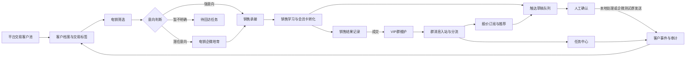

# 完整使用文档

本文档面向销售、运营、产品、研发和多人协作成员，说明当前系统能做什么、端到端业务流程如何流转、每个页面如何实际使用，以及哪些能力已经真实可用、哪些仍是本地模拟或待生产接入。

## 1. 系统定位

本系统是“客户运营中台”的本地可运行版本，用来验证从平台交易客户池到电销筛选、销售承接、VIP群维护、报价订阅、触达草稿和数据回流的完整闭环。

当前系统会真实写入本地状态文件 `data/state.json`，包括客户档案、客户事件、会话上下文、任务、报价、销售样本、模型配置、企微配置、企微群绑定、个人微信Mock队列、触达草稿、Agent运行记录和审计日志。

当前系统不会自动执行真实外呼、短信、CRM同步、企微私聊发送或个人微信真实发送。只有在配置企微测试群机器人Webhook后，人工确认的草稿或测试消息才会真实发送到企微测试群机器人。企微智能机器人长连接启动后，可以读取真实企微智能机器人消息并按 `chatid` 独立归档。

## 2. 快速启动

首次拉取代码后安装依赖：

```bash
npm install
```

启动本地系统：

```bash
npm run dev
```

打开浏览器访问：

```text
http://127.0.0.1:5175
```

运行测试：

```bash
npm test
```

启动企微智能机器人长连接：

```bash
npm run wecom:bridge
```

只检查企微 Bot ID/Secret 是否能认证：

```bash
npm run wecom:bridge -- --check --timeout=20000
```

## 3. 数据、安全和重置

本地运行数据保存在：

```text
data/state.json
```

该目录已加入 `.gitignore`，不要提交到GitHub。模型 API Key、企微Webhook、Bot ID、Secret、入站Secret都会只保存在本地状态文件中，前端和公开API只返回“是否已配置”和掩码，不回显明文。

需要恢复初始样例数据时，在页面右上角点击“重置数据”。这会清空当前本地运行状态并重新生成样例客户、报价、任务、模板和基础配置。重置前请确认没有需要保留的本地测试数据。

## 4. 总体业务闭环



系统里的核心思想是：所有Agent、人工动作和外部连接都围绕同一套客户档案、事件流、任务中心、报价库、触达草稿和审计日志工作。不同业务页面不是孤立工具，而是同一条客户生命周期链路的不同工作台。

## 5. 导航结构

左侧导航按业务模块分组：

| 一级菜单 | 二级页面 | 主要用途 |
| --- | --- | --- |
| 总览 | 运营总览、闭环编排 | 看全局指标、系统蓝图、角色工作台，批量生成下一步计划 |
| 客户管理 | 客户旅程、客户档案、报价订阅 | 维护客户资料、阶段、标签、关注型号和结构化报价 |
| 电销管理 | 电销客户池、电销消息、电销任务 | 处理待筛选/待外呼/电销培育客户和电销任务 |
| 销售管理 | 销售Agent、销售学习、销售任务 | 承接会员卡销售、沉淀销售技巧、跟进销售任务 |
| 群聊管理 | 群消息入站、企微接入、群触达草稿、群聊任务 | 测试VIP群分流、企微消息归档、草稿发送和群任务 |
| 设置 | 模型配置、企微接入、模板与风控、系统自检 | 配置模型、外部连接、模板边界和健康检查 |

顶部固定按钮：

- “重置数据”：恢复初始本地样例。
- “运行系统自检”：检查客户、任务、报价、模板、模型配置、企微配置、个人微信Mock队列和审计一致性。
- “批量运行本地Agent”：按当前客户阶段批量运行外呼、培育、销售、VIP、报价和闭环编排Agent。

## 6. 标准使用流程

### 6.1 初始化和自检

1. 启动系统并打开 `http://127.0.0.1:5175`。
2. 在“总览”查看客户档案数、任务、触达草稿和订阅客户。
3. 点击“运行系统自检”，确认页面进入“系统自检”，结果为通过。
4. 如果自检失败，先看失败项，再回到对应页面修复客户、任务、报价、模板或连接配置。

### 6.2 配置模型

进入“设置 > 模型配置”。

全局LLM配置适用于所有Agent：

- 供应商/网关：例如 DeepSeek兼容网关。
- API URL：例如 `https://api.deepseek.com`。
- API Key：只输入一次，保存后不回显明文。
- 模型名：例如 `deepseek-v4-flash`。
- 温度：控制回答稳定/发散程度。低温更稳定保守，适合客服和销售承接；高温更发散，适合创意文案。
- 最大输出Token：控制模型单次回复长度上限。

各Agent独立配置位于页面下方。某个Agent不填独立配置时，会自动继承全局LLM。只填写部分字段时，未填写字段也会回退全局配置。

ASR语音识别和TTS语音合成配置当前用于保存后续语音链路参数，暂未接入真实外呼语音执行器。

保存后可以点击“测试全局连接”或“测试销售Agent连接”。测试会真实调用OpenAI兼容 `chat/completions` 接口；缺少API Key时不会发起外部请求。

### 6.3 维护客户池

进入“客户管理 > 客户档案”。

可执行操作：

- 搜索客户名、联系人、手机号、标签和关注型号。
- 按阶段、会员状态、负责人筛选。
- 新增客户。
- 维护客户阶段、负责人、标签和关注型号。
- 记录销售结果，包括成交、继续培育、暂缓等。

进入“客户管理 > 客户旅程”可以按阶段看客户流转状态。点击客户后，系统会切换当前维护对象，Agent控制台、报价订阅、本地消息等页面都会围绕当前客户展示。

### 6.4 电销筛选

进入“电销管理 > 电销客户池”。

该入口会自动预设客户筛选条件，只看待筛选、待外呼和电销企微培育阶段的客户。

建议操作顺序：

1. 选择一个客户。
2. 进入“销售管理 > 销售Agent”。
3. 在客户消息里输入客户表达，例如“最近iPhone 13有没有稳定报价，会员卡有什么优惠”。
4. 点击“运行本地电销评分”或“分析电销回复”。
5. 查看系统生成的客户判断、下一步动作、建议话术、任务和触达草稿。

电销筛选Agent会根据客户交易额、采购频次、最近交易、会员状态和标签判断客户意向。强意向客户会进入销售承接，潜在客户会进入电销培育，低意向客户会生成待回访任务。

### 6.5 销售承接和销售学习

进入“销售管理 > 销售Agent”。

该页面面向销售和运营使用，不展示代码或原始JSON。主要看：

- 当前客户摘要。
- 常用客户消息场景。
- 客户意图判断。
- 下一步建议。
- 销售话术草稿。
- 推荐卡种或报价。
- 生成的任务和触达草稿。
- 执行边界：本地规则、真实LLM是否调用、是否触发外部副作用。

如果已经配置LLM，可以勾选“本次使用真实LLM增强”后再运行销售承接。系统会先运行本地规则Agent，再把客户摘要、当前消息和本地结果发给模型生成增强建议。增强结果仍只写入本地建议和触达草稿，不会自动发给客户。

进入“销售管理 > 销售学习”可以录入成交或培育话术样本。高质量成交样本会被销售承接Agent引用，用于生成更贴近团队打法的话术。

### 6.6 触达草稿

进入“群聊管理 > 群触达草稿”。

触达草稿来源包括：

- Agent运行后自动生成。
- LLM增强后生成。
- 人工手动新增。

草稿支持：

- 搜索。
- 按状态、渠道、优先级、风险筛选。
- 单条确认、复制、人工已处理、废弃。
- 批量确认、批量处理、批量废弃。
- 已确认草稿发送到企微测试群机器人。

重要边界：

- “确认”“复制”“人工已处理”“废弃”都只更新本地状态，不会外发。
- 高风险草稿不能批量确认，需要单条复核。
- 未确认草稿不能发送企微测试群。
- 只有调用“发送企微测试群”成功后，草稿才会变成“企微已发送”并记录外部副作用。

### 6.7 任务中心

进入“电销任务”“销售任务”“群聊任务”或通过页面跳转进入任务中心。

任务中心承接：

- 电销回访。
- 销售线索。
- 会员卡承接。
- VIP群问题。
- 售后分流。
- 报价咨询。
- 主管升级。

可执行操作：

- 搜索任务。
- 按角色、负责人、状态、优先级、SLA筛选。
- 勾选任务批量改为跟进中或已完成。
- 点击“SLA巡检升级”把超时未完成任务升级到主管队列。

任务完成后会写入 `completedAt`，客户事件和审计日志也会同步更新。

### 6.8 报价订阅

进入“客户管理 > 报价订阅”。

可执行操作：

- 搜索型号。
- 按品牌、配置、库存、最低价、最高价筛选。
- 订阅客户关注型号。
- 新增或更新结构化报价。

报价推荐Agent会优先根据客户关注型号、标签和库存状态推荐报价，并生成推荐理由和可推送文案。订阅行为会回写客户档案和事件流。

### 6.9 VIP群消息和分流

进入“群聊管理 > 群消息入站”。

可以模拟写入VIP群消息，例如：

```text
@销售 上周那批 Mate60 有两台售后维修怎么处理？顺便今天报价发一下。
```

系统会把消息写入本地会话窗口，并运行VIP群分流Agent。Agent会判断：

- 客户问的是售后、报价、投诉、客服还是财务问题。
- 客户@的人是否合适。
- 是否存在重复问题。
- 是否已有未完成任务。
- 应该由销售、私域、客服、售后或主管谁来处理。

无法直接解决的问题会进入任务中心。能生成触达建议的问题会进入触达草稿队列。

### 6.10 企微接入

进入“群聊管理 > 企微接入”或“设置 > 企微接入”。

当前有两条企微链路：

1. 企微测试群机器人Webhook：用于发送测试消息和已确认草稿。
2. 企微智能机器人长连接：用于读取真实企微智能机器人消息，并按 `chatid` 独立归档。

配置测试群机器人Webhook：

1. 启用企微连接。
2. 填入群机器人Webhook。
3. 设置发送模式为“人工确认”。
4. 保存企微配置。
5. 点击“发送测试消息”验证。

配置智能机器人长连接：

1. 启用智能机器人。
2. 填入 Bot ID 和 Secret。
3. 设置默认客户和默认渠道。
4. 保存企微配置。
5. 在终端运行 `npm run wecom:bridge -- --check --timeout=20000` 做认证检查。
6. 认证通过后运行 `npm run wecom:bridge` 持续读取消息。

消息归档规则：

- 系统按 `externalMessageId/msgid` 去重。
- 系统按 `chatid` 查找群绑定。
- 未知 `chatid` 会自动生成“待绑定”客户群档案，防止不同群消息串档。
- 在“群聊归档绑定”区域把 `chatid` 绑定到真实客户和业务渠道。

自动回复默认关闭。当前建议先只做消息读取、归档、分流和任务生成，确认策略稳定后再接生产级发送审批。

### 6.11 个人微信 AccountAgent Mock

企微接入页还有个人微信单账号 AccountAgent Mock 区域，用于验证“一个托管号加入多个外部群，一个账号对应一个Agent”的产品链路。

当前能力：

- 按 `roomId` 维护不同外部群上下文。
- 低风险消息生成待发送队列。
- 高风险报价、锁价、退款、赔偿、付款、合同和承诺类消息进入人工确认。
- 重复 `messageId` 去重。
- 员工或托管号已回复时取消同群待发。
- 模拟发送回显后写入本地会话和客户事件。

当前边界：

- 不连接真实个人微信。
- 不真实发送个人微信消息。
- 发送确认只是Mock回显和流程验证。

### 6.12 闭环编排

进入“总览 > 闭环编排”。

闭环编排Agent会扫描全部客户，生成：

- 下一步动作。
- 推荐触达渠道。
- 负责人角色。
- 成功指标。
- 任务建议。
- 报价推荐。

适合在每天运营开始时运行一次，用来统一生成当天的客户推进计划。生成结果会进入客户事件、任务中心和审计日志。

### 6.13 模板与风控

进入“设置 > 模板与风控”。

这里维护触达模板和风险边界。高风险模板不应自动启用，涉及投诉、赔偿、退款、锁价、付款、合同和责任承诺的内容需要人工复核。

## 7. Agent能力说明

| Agent | 当前能力 | 输入来源 | 输出去向 |
| --- | --- | --- | --- |
| 外呼筛选Agent | 根据交易和标签做意向评分、分层和转交 | 客户档案、本地客户消息 | 客户阶段、标签、任务、事件、草稿 |
| 电销培育Agent | 判断电销企微消息是否可升级销售 | 本地消息、客户档案 | 销售任务、培育建议、触达草稿 |
| 销售承接Agent | 识别会员卡意向、报价异议，生成销售话术 | 客户档案、销售样本、客户消息、可选LLM | 话术建议、推荐卡种、任务、草稿 |
| VIP群分流Agent | 识别群内问题类型、@错人、重复问题和未结任务 | VIP群会话、企微入站、个人微信Mock入站 | 分流任务、处理建议、草稿 |
| 报价推荐Agent | 推荐客户关注型号和可推送报价 | 客户关注型号、标签、报价库 | 推荐报价、订阅回流、触达草稿 |
| 闭环编排Agent | 为全量客户生成下一步运营动作 | 全部客户、任务、报价、事件 | 闭环计划、任务、审计 |

默认情况下，Agent由本地规则引擎稳定执行。勾选真实LLM增强时，系统会在本地规则结果基础上调用你配置的LLM生成增强建议，但仍不会自动外发。

## 8. 外部动作边界

| 动作 | 当前状态 | 是否真实触达客户 |
| --- | --- | --- |
| 本地Agent运行 | 已可用 | 否 |
| 真实LLM增强 | 已可用，需配置Key | 否，只生成本地建议和草稿 |
| 触达草稿确认/复制/废弃 | 已可用 | 否 |
| 企微测试群机器人发送 | 已可用，需配置Webhook且人工点击 | 是，发送到测试群机器人 |
| 企微智能机器人长连接读消息 | 已可用，需配置Bot ID/Secret并运行bridge | 只读取，不自动回复 |
| 个人微信AccountAgent | Mock可运行 | 否 |
| 外呼、短信、CRM同步 | 未接入 | 否 |
| ASR/TTS语音模型 | 可保存配置 | 否，尚未接语音执行器 |

## 9. 推荐验收流程

### 9.1 本地闭环验收

1. 点击“重置数据”。
2. 点击“运行系统自检”，确认通过。
3. 点击“批量运行本地Agent”。
4. 进入“客户管理 > 客户旅程”，确认客户阶段和事件更新。
5. 进入“销售管理 > 销售Agent”，选择客户并运行销售承接。
6. 进入“群聊管理 > 群消息入站”，写入一条VIP群消息。
7. 进入“群聊管理 > 群触达草稿”，确认草稿生成并可流转状态。
8. 进入“任务中心”，确认任务生成、筛选和批量完成可用。
9. 进入“报价订阅”，订阅一个型号并确认客户档案回流。
10. 再次运行“系统自检”，确认没有失败项。

### 9.2 LLM验收

1. 在“设置 > 模型配置”填入全局LLM API URL、API Key和模型名。
2. 点击“测试全局连接”。
3. 进入“销售管理 > 销售Agent”。
4. 勾选“本次使用真实LLM增强”。
5. 运行销售承接Agent。
6. 确认右侧出现真实LLM增强建议，并在触达草稿队列出现LLM增强草稿。
7. 确认执行边界仍显示未触发外部触达副作用。

### 9.3 企微验收

1. 在“企微接入”配置测试群机器人Webhook。
2. 点击“发送测试消息”，确认企微测试群收到消息。
3. 在触达草稿页把一条低风险草稿改为“已确认”。
4. 点击“发送企微测试群”，确认草稿状态变为“企微已发送”。
5. 配置智能机器人 Bot ID/Secret。
6. 运行 `npm run wecom:bridge -- --check --timeout=20000`。
7. 认证通过后运行 `npm run wecom:bridge`。
8. 在测试群发送消息，回到“企微接入”查看是否出现群绑定或入站日志。
9. 如果出现待绑定群，在群聊归档绑定区域绑定到真实客户。
10. 运行系统自检，确认企微群绑定有效。

## 10. 多人协作规范

完整制度见仓库根目录 `CONTRIBUTING.md`。本系统采用 **PR合并 + Tag/Release版本保留**：`main` 永远代表最新稳定版本，成员不得直接向 `main` 推送业务代码；每次重要更新通过Git Tag和GitHub Release保留历史版本，不在仓库里复制旧版本目录。

首次克隆仓库：

```bash
git clone https://github.com/JUJUJUN313/customer-ops-agent-console.git
cd customer-ops-agent-console
npm install
```

开始任何任务前，先从线上最新 `main` 创建独立分支：

```bash
git checkout main
git fetch origin
git pull --ff-only origin main
git checkout -b feature/your-task
```

分支命名规则：

- 新功能：`feature/功能名`
- 修复：`fix/问题名`
- 文档：`docs/说明名`
- Codex协作：`codex/任务名`
- 紧急修复：`hotfix/问题名`

提交或推送前必须核对线上线下差异：

```bash
git fetch origin
git status -sb
git log --oneline HEAD..origin/main
git diff --stat origin/main...HEAD
npm test
```

如果 `git log --oneline HEAD..origin/main` 有输出，说明线上已经有人更新，必须先同步：

```bash
git rebase origin/main
npm test
```

只推送自己的分支：

```bash
git push -u origin feature/your-task
```

然后在GitHub创建Pull Request，目标分支必须是 `main`。

PR合并前必须确认：

- PR无冲突。
- 自动测试通过。
- 至少1名维护者Review通过。
- GitHub比较页只包含本次任务相关文件。
- PR说明写清功能、页面/API/数据结构变化、测试结果和文档同步情况。
- 涉及模型Key、企微、个人微信、外部发送或安全边界时，必须在PR里明确说明。
- 不提交 `data/state.json`、`.env`、API Key、企微Webhook、Bot ID、Secret、GitHub Token 或个人微信真实凭据。

默认使用 **Squash and merge** 合并，让一次PR在 `main` 上只形成一个清晰提交。大型功能可以保留普通Merge，但必须有清楚PR标题和说明。禁止 force push 覆盖别人的分支或 `main`。

版本保留规则：

- `main` 只保留当前最新稳定代码。
- 每次可测试版本或阶段性版本打 `vX.Y.Z` 标签。
- 在GitHub Releases里基于该Tag创建Release，写明新增功能、修复问题、使用方式变化、已知风险和回退方式。
- 回退旧版本时使用Release源码包或 `git checkout vX.Y.Z`。

发布示例：

```bash
git checkout main
git pull --ff-only origin main
git tag -a v0.2.0 -m "v0.2.0: 企微接入与协作规范"
git push origin v0.2.0
```

文档同步规则：

- 每次功能更新必须同步更新 README、相关专题文档和 `docs/CHANGELOG.md`。
- 涉及使用方式、业务流程、模型配置、企微/个人微信接入、Agent能力或外部动作边界变化时，必须同步更新本文档。
- 新增协作、发布或安全规则时，必须同步更新 `CONTRIBUTING.md`。

## 11. 常见问题

### 页面打不开

确认本地服务已启动：

```bash
npm run dev
```

默认端口是 `5175`。如果端口被占用，可以用：

```bash
PORT=5176 npm run dev
```

### 模型测试失败

检查：

- API URL是否是OpenAI兼容接口网关。
- API Key是否已保存。
- 模型名是否正确。
- 网络是否能访问供应商。

如果缺少Key，系统会提示配置缺失，不会发起外部请求。

### 保存Key后输入框为空

这是正常安全设计。系统不回显明文Key，只显示是否已配置和掩码。输入框留空代表保留旧Key，勾选“清空已保存Key”才会删除。

### 企微bridge认证失败

检查：

- 企微智能机器人是否启用。
- Bot ID和Secret是否保存。
- 本地API服务是否正在运行。
- 企业微信侧智能机器人权限和配置是否正确。
- 终端命令是否在项目根目录执行。

### 企微消息没有绑定到正确客户

如果是真实长连接消息，先看“企微接入 > 群聊归档绑定”。未知 `chatid` 会进入待绑定状态，需要人工绑定到客户档案和业务渠道。绑定后同一 `chatid` 的后续消息会进入对应客户。

### 草稿不能发送企微

检查：

- 企微连接是否启用。
- Webhook路由是否已配置并启用。
- 草稿状态是否为“已确认”。
- 发送模式是否允许人工确认发送。
- 当前是否选择了正确路由。

### 个人微信任务不能确认

这是Mock队列的风控结果。可能原因：

- 任务超过 `maxQueueAgeSeconds`，已过期取消。
- 单账号未满足 `minSendIntervalSeconds`，需要等待。
- 高风险消息停在人工确认，不自动发送。
- 同群已有员工或托管号回复，待发任务被取消。

## 12. 当前仍需生产化补足

当前系统已经能验证本地业务闭环、模型增强、企微测试群发送、企微智能机器人长连接读取、`chatid` 独立归档和个人微信AccountAgent Mock流程。

生产化仍需补足：

- 真实外呼平台、ASR、TTS和通话质检。
- 短信或企微私聊触达执行器。
- 企微客户联系、通讯录、权限、审批和回调。
- 真实个人微信Gateway、登录态、掉线重连和合规审批。
- CRM、交易系统和报价系统的实时同步。
- 生产级密钥管理、权限管理、审计留存和失败重试。
- 更完整的销售知识库、质检评分、A/B策略回流和模型评估。

因此，当前版本适合做本地产品验证、团队协作开发、流程演示和企微测试接入验证；进入生产前需要继续补齐外部系统适配和合规治理。
